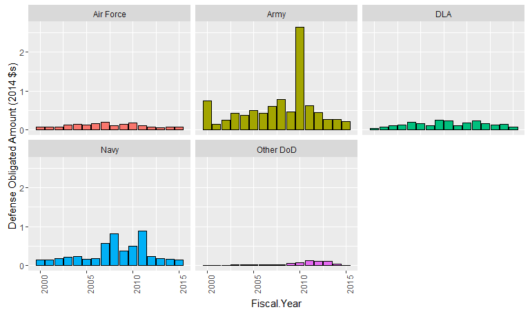
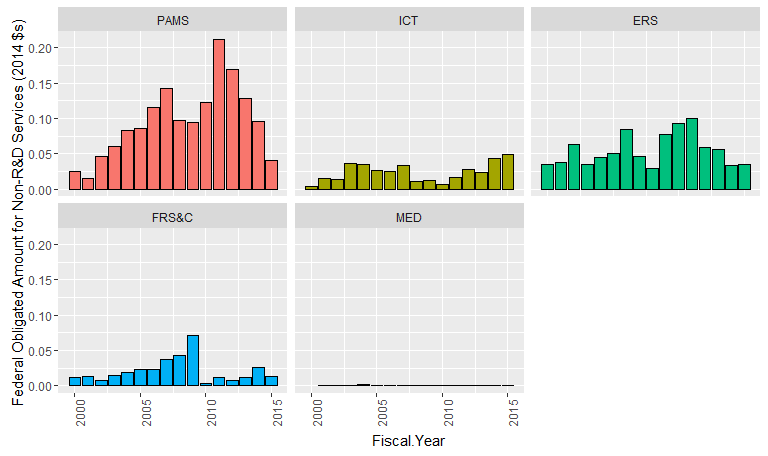
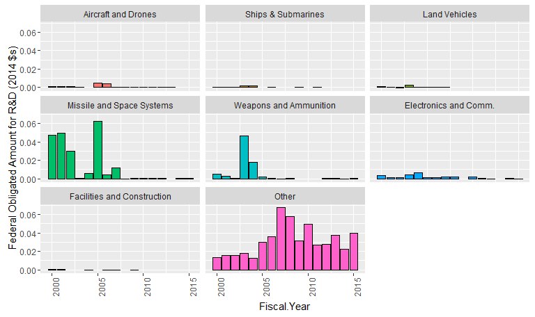
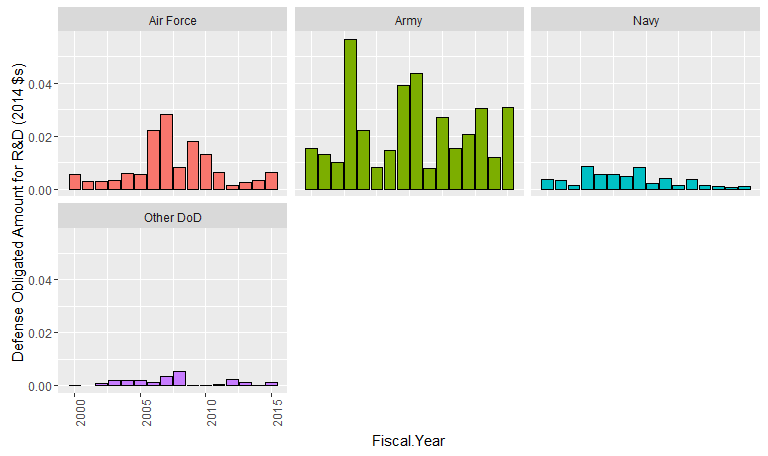

# Prime contracting for involving U.S.-Canada vendors
Greg Sanders  
July 14, 2016  

This is an R Markdown document. Markdown is a simple formatting syntax for authoring HTML, PDF, and MS Word documents. For more details on using R Markdown see <http://rmarkdown.rstudio.com>.

When you click the **Knit** button a document will be generated that includes both content as well as the output of any embedded R code chunks within the document. You can embed an R code chunk like this:


```r
library(plyr)
require(ggplot2)
```

```
## Loading required package: ggplot2
```

```r
require(scales)
```

```
## Loading required package: scales
```

```r
setwd("K:\\Development\\Canada")
Path<-"K:\\2007-01 PROFESSIONAL SERVICES\\R scripts and data\\"
# Path<-"C:\\Users\\Greg Sanders\\SkyDrive\\Documents\\R Scripts and Data SkyDrive\\"
source(paste(Path,"lookups.r",sep=""))
```

```
## Loading required package: stringr
```

```r
source(paste(Path,"helper.r",sep=""))
```

```
## Loading required package: grid
## Loading required package: reshape2
## Loading required package: lubridate
## 
## Attaching package: 'lubridate'
## 
## The following object is masked from 'package:plyr':
## 
##     here
```

```r
Coloration<-read.csv(
  paste(Path,"Lookups\\","Lookup_coloration.csv",sep=""),
  header=TRUE, sep=",", na.strings="NA", dec=".", strip.white=TRUE, 
  stringsAsFactors=FALSE
)

#Clear out lines from the coloration CSV where no variable is listed.
Coloration<-subset(Coloration, variable!="")
```


```r
CanadaFederal  <- read.csv(
    paste("Data\\Location_CCCvendorIdentification.csv", sep = ""),
    header = TRUE, sep = ",", dec = ".", strip.white = TRUE, 
    na.strings = c("NULL","NA",""),
    stringsAsFactors = TRUE
)

CanadaFederal<-apply_lookups(Path,CanadaFederal)
```

```
## Joining by: Customer, SubCustomer
## Joining by: ProductServiceOrRnDarea
## Joining by: PlatformPortfolio
## Joining by: Fiscal.Year
```

```
## Warning in apply_lookups(Path, CanadaFederal): NaNs produced
```

```r
CanadaSample<-subset(CanadaFederal,Customer %in% c("Defense","NASA","DHS","State and IAP") | 
                         SubCustomer %in% c("Interior","Transportation","Justice"))


# CanadaSample$Category[CanadaSample$AnyIsSmall==0]<-"Never Small"
# CanadaSample$Category[CanadaSample$AlwaysIsSmall==1]<-"Always Small"
# CanadaSample$Category[CanadaSample$AlwaysIsSmall==0 & 
#                              CanadaSample$AnyIsSmall==1]<-"Sometimes Small"
# 

CanadaCategoryNotVendor<-ddply(CanadaSample,.(Fiscal.Year,
                                            Customer,SubCustomer,SubCustomer.component,SubCustomer.sum,SubCustomer.detail,
                                            PlatformPortfolio,PlatformPortfolio.sum,
                                            ProductServiceOrRnDarea,ServicesCategory.sum,
                                            ProductOrServiceCode,
                                            ProductOrServiceCodeText
                                            ),
      summarize,
      # count=length(FiscalYear),
      # ObligatedAmount=sum(ObligatedAmount),
      Obligation.2014=sum(Obligation.2014)
      )

write.csv(CanadaCategoryNotVendor,"Data\\CanadaSampleCustomerPlatformBucket.csv")

CanadaCategoryNotVendor$Agency<-as.character(CanadaCategoryNotVendor$Customer)
CanadaCategoryNotVendor$Agency[CanadaCategoryNotVendor$Agency=="Other Agencies"]<-
    as.character(CanadaCategoryNotVendor$SubCustomer[CanadaCategoryNotVendor$Agency=="Other Agencies"])
CanadaCategoryNotVendor$Agency<-factor(CanadaCategoryNotVendor$Agency)


# DunsCountyByPercent<-ddply(CanadaSample,.(RoundedPercentSmall,AnyIsSmall,AlwaysIsSmall,Category),
#       summarize,
#       count=length(FiscalYear),
#       ObligatedAmount=sum(ObligatedAmount),
#       ObligatedAmountisSmall=sum(ObligatedAmountisSmall)
#       )

# DunsCountyByPercent$SmallValueThreshold[DunsCountyByPercent$RoundedPercentSmall>=0.25]<-">=25%"
# DunsCountyByPercent$SmallValueThreshold[DunsCountyByPercent$RoundedPercentSmall<0.25 &
#                                               DunsCountyByPercent$RoundedPercentSmall>=0.1]<-"[10%-25%)"
# 
# DunsCountyByPercent$SmallValueThreshold[DunsCountyByPercent$RoundedPercentSmall<0.1 &
#                                         DunsCountyByPercent$RoundedPercentSmall>=0.01]<-"[1%-10%)"
# DunsCountyByPercent$SmallValueThreshold[DunsCountyByPercent$RoundedPercentSmall<0.01 ]<-"<1%"
# # DunsCountyByPercent$SmallValueThreshold[is.na(DunsCountyByPercent$RoundedPercentSmall)]<-"NA"
# DunsCountyByPercent$SmallValueThreshold<-ordered(DunsCountyByPercent$SmallValueThreshold,levels=c("<1%","[1%-10%)","[10%-25%)",">=25%"))
```


```r
ggplot( CanadaCategoryNotVendor,
        aes(x = Fiscal.Year,
            weight = Obligation.2014,
            fill=Agency
        )) +
    geom_bar(alpha = 1,  colour = "black")+
    # scale_x_continuous(limits=c(-0.05,1.05))+
    facet_wrap(~  Agency , ncol=3)+ #, scales="free_y",space="free_y"
    theme(legend.position="none")+
    scale_y_continuous("Federal Obligated Amount (2014 $s)",labels=comma)+theme(axis.text.x=element_text(angle=90))
```

 

```r
ggplot( subset(CanadaCategoryNotVendor,Customer=="Defense"),
        aes(x = Fiscal.Year,
            weight = Obligation.2014,
            fill=SubCustomer.detail
        )) +
    geom_bar(alpha = 1,  colour = "black")+
    # scale_x_continuous(limits=c(-0.05,1.05))+
    facet_wrap(~  SubCustomer.detail ,ncol=3)+ #, scales="free_y",space="free_y"
    theme(legend.position="none")+
    scale_y_continuous("Defense Obligated Amount (2014 $s)",labels=comma)+theme(axis.text.x=element_text(angle=90))
```

```
## Warning in loop_apply(n, do.ply): Stacking not well defined when ymin != 0
```

 

```r
ggplot( subset(CanadaCategoryNotVendor,Customer!="Defense"),
        aes(x = Fiscal.Year,
            weight = Obligation.2014,
            fill=Agency
        )) +
    geom_bar(alpha = 1,  colour = "black")+
    # scale_x_continuous(limits=c(-0.05,1.05))+
    facet_wrap(~  Agency ,ncol=3)+ #, scales="free_y",space="free_y"
    theme(legend.position="none")+
    scale_y_continuous("Federal Obligated Amount (2014 $s)",labels=comma)+theme(axis.text.x=element_text(angle=90))
```

 


```
## Warning in loop_apply(n, do.ply): Stacking not well defined when ymin != 0
```

 

```
## Warning in loop_apply(n, do.ply): Stacking not well defined when ymin != 0
```

 

```
## Warning in loop_apply(n, do.ply): Stacking not well defined when ymin != 0
```

 

```
## Warning in loop_apply(n, do.ply): Stacking not well defined when ymin != 0
```

 

```
## Warning in loop_apply(n, do.ply): Stacking not well defined when ymin != 0
```

 

```
## Warning in loop_apply(n, do.ply): Stacking not well defined when ymin != 0
```

 

```
## Warning in loop_apply(n, do.ply): Stacking not well defined when ymin != 0
```

```
## Warning in loop_apply(n, do.ply): Stacking not well defined when ymin != 0
```

```
## Warning in loop_apply(n, do.ply): Stacking not well defined when ymin != 0
```

```
## Warning in loop_apply(n, do.ply): Stacking not well defined when ymin != 0
```

 


```r
ggplot( subset(CanadaCategoryNotVendor,ServicesCategory.sum=="R&D"),
        aes(x = Fiscal.Year,
            weight = Obligation.2014,
            fill=ProductServiceOrRnDarea
        )) +
    geom_bar(alpha = 1,  colour = "black")+
    # scale_x_continuous(limits=c(-0.05,1.05))+
    facet_wrap(~  ProductServiceOrRnDarea ,ncol=3 )+ #, scales="free_y",space="free_y"
    theme(legend.position="none")+
    scale_y_continuous("Federal Obligated Amount for R&D (2014 $s)",labels=comma)+theme(axis.text.x=element_text(angle=90))
```

```
## Warning in loop_apply(n, do.ply): Stacking not well defined when ymin != 0
```

```
## Warning in loop_apply(n, do.ply): Stacking not well defined when ymin != 0
```

```
## Warning in loop_apply(n, do.ply): Stacking not well defined when ymin != 0
```

```
## Warning in loop_apply(n, do.ply): Stacking not well defined when ymin != 0
```

 

```r
ggplot( subset(CanadaCategoryNotVendor,ServicesCategory.sum=="R&D"),
        aes(x = Fiscal.Year,
            weight = Obligation.2014,
            fill=PlatformPortfolio.sum
        )) +
    geom_bar(alpha = 1,  colour = "black")+
    # scale_x_continuous(limits=c(-0.05,1.05))+
    facet_wrap(~  PlatformPortfolio.sum  ,ncol=3)+ #, scales="free_y",space="free_y"
        theme(legend.position="none")+
    scale_y_continuous("Federal Obligated Amount for R&D (2014 $s)",labels=comma)+theme(axis.text.x=element_text(angle=90))
```

```
## Warning in loop_apply(n, do.ply): Stacking not well defined when ymin != 0
```

```
## Warning in loop_apply(n, do.ply): Stacking not well defined when ymin != 0
```

```
## Warning in loop_apply(n, do.ply): Stacking not well defined when ymin != 0
```

```
## Warning in loop_apply(n, do.ply): Stacking not well defined when ymin != 0
```

```
## Warning in loop_apply(n, do.ply): Stacking not well defined when ymin != 0
```

 

```r
ggplot( subset(CanadaCategoryNotVendor,ServicesCategory.sum=="R&D"),
        aes(x = Fiscal.Year,
            weight = Obligation.2014,
            fill=Agency
        )) +
    geom_bar(alpha = 1,  colour = "black")+
    # scale_x_continuous(limits=c(-0.05,1.05))+
    facet_wrap(~  Agency ,ncol=3 )+ #, scales="free_y",space="free_y"
        theme(legend.position="none")+
    scale_y_continuous("Federal Obligated Amount for R&D (2014 $s)",labels=comma)+theme(axis.text.x=element_text(angle=90))
```

```
## Warning in loop_apply(n, do.ply): Stacking not well defined when ymin != 0
```

```
## Warning in loop_apply(n, do.ply): Stacking not well defined when ymin != 0
```

```
## Warning in loop_apply(n, do.ply): Stacking not well defined when ymin != 0
```

 

```r
ggplot( subset(CanadaCategoryNotVendor,ServicesCategory.sum=="R&D" & Customer=="Defense"),
        aes(x = Fiscal.Year,
            weight = Obligation.2014,
            fill=SubCustomer.detail
        )) +
    geom_bar(alpha = 1,  colour = "black")+
    # scale_x_continuous(limits=c(-0.05,1.05))+
    facet_wrap(~  SubCustomer.detail ,ncol=3)+ #, scales="free_y",space="free_y"
        theme(legend.position="none")+
    scale_y_continuous("Defense Obligated Amount for R&D (2014 $s)",labels=comma)+theme(axis.text.x=element_text(angle=90))
```

```
## Warning in loop_apply(n, do.ply): Stacking not well defined when ymin != 0
```

 


```r
CanadaSample$ParentIDorVendor<-as.character(CanadaSample$ParentID)
CanadaSample$ParentIDorVendor[is.na(CanadaSample$ParentIDorVendor)]<-
    as.character(CanadaSample$StandardizedTopContractor[is.na(CanadaSample$ParentIDorVendor)])
CanadaSample$ParentIDorVendor[CanadaSample$ParentIDorVendor=="CANADIAN COMMERCIAL CORPORATION" & !is.na(CanadaSample$Supplier)]<-
    as.character(CanadaSample$Supplier[CanadaSample$ParentIDorVendor=="CANADIAN COMMERCIAL CORPORATION" & !is.na(CanadaSample$Supplier)])

CanadaSample$ParentIDorVendor<-factor(CanadaSample$ParentIDorVendor)


CanadaVendor<-ddply(CanadaSample,.(ParentIDorVendor,ParentID),
      summarize,
      # count=length(FiscalYear),
      # ObligatedAmount=sum(ObligatedAmount),
      Obligation.2014=sum(Obligation.2014)
      )


CanadaVendor<-CanadaVendor[order(CanadaVendor$Obligation.2014,decreasing=TRUE),]
```
