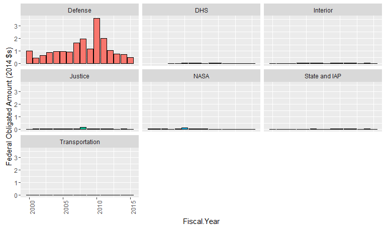
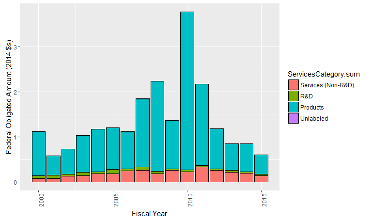
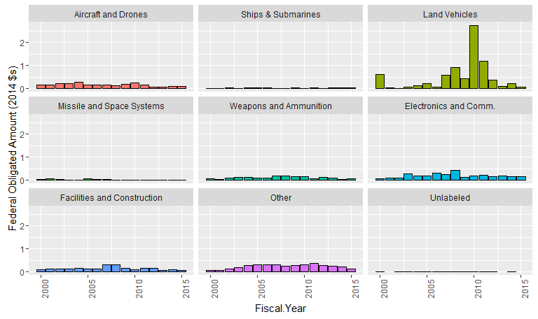
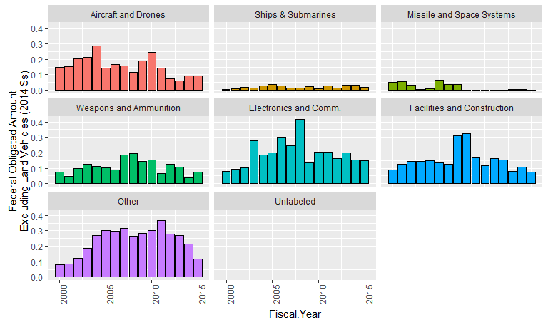
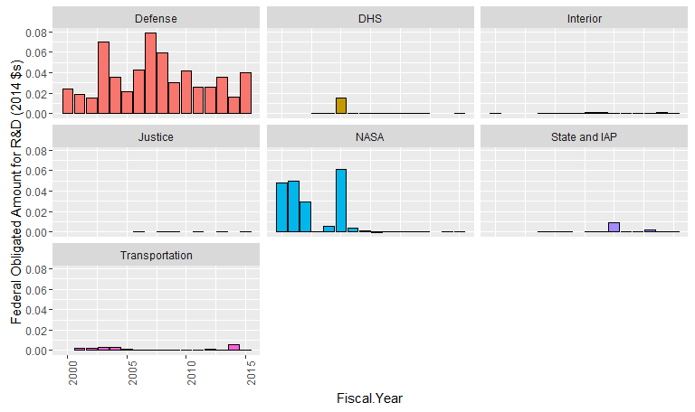
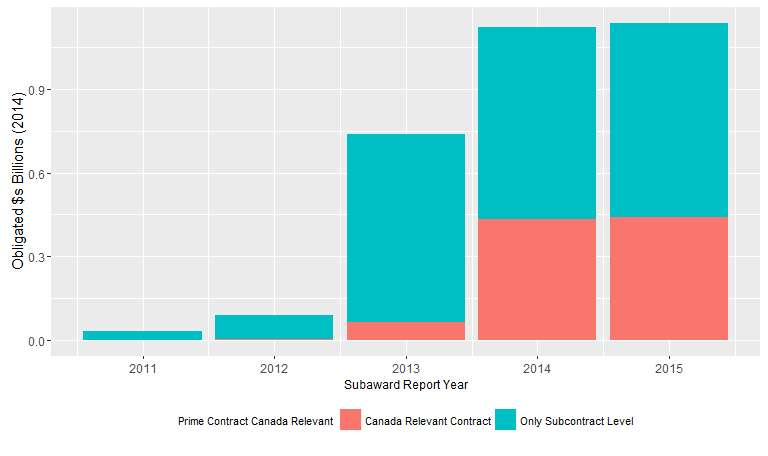

# Prime contracting for involving U.S.-Canada vendors
Greg Sanders  
July 14, 2016  

This is an R Markdown document. Markdown is a simple formatting syntax for authoring HTML, PDF, and MS Word documents. For more details on using R Markdown see <http://rmarkdown.rstudio.com>.

When you click the **Knit** button a document will be generated that includes both content as well as the output of any embedded R code chunks within the document. You can embed an R code chunk like this:


```r
library(plyr)
require(ggplot2)
```

```
## Loading required package: ggplot2
```

```r
require(scales)
```

```
## Loading required package: scales
```

```r
# setwd("K:\\Development\\Canada")
setwd("D:\\Users\\Greg Sanders\\Documents\\Development\\Canada")
# Path<-"K:\\2007-01 PROFESSIONAL SERVICES\\R scripts and data\\"
Path<-"D:\\Users\\Greg Sanders\\Documents\\Development\\R-scripts-and-data\\"
source(file.path(Path,"lookups.r"))
```

```
## Loading required package: stringr
```

```r
source(file.path(Path,"helper.r"))
```

```
## Loading required package: grid
```

```
## Loading required package: reshape2
```

```
## Loading required package: lubridate
```

```
## 
## Attaching package: 'lubridate'
```

```
## The following object is masked from 'package:plyr':
## 
##     here
```

```
## The following object is masked from 'package:base':
## 
##     date
```

```r
Coloration<-read.csv(
  paste(Path,"Lookups\\","Lookup_coloration.csv",sep=""),
  header=TRUE, sep=",", na.strings="NA", dec=".", strip.white=TRUE, 
  stringsAsFactors=FALSE
)

#Clear out lines from the coloration CSV where no variable is listed.
Coloration<-subset(Coloration, variable!="")
```


```r
CanadaFPDS<-read.csv(unz(file.path("Data","Location_CanadaRelatedFPDScomplete.zip"),
                         "Location_CanadaRelatedFPDScomplete.csv"),
                     na.strings=c("NULL","NA"),
                     header=TRUE)
CanadaFPDS<-apply_lookups(Path,CanadaFPDS)
```

```
## Joining by: Customer, SubCustomer
```

```
## Joining by: ProductServiceOrRnDarea
```

```
## Joining by: PlatformPortfolio
```

```
## Joining by: Fiscal.Year
```

```
## Warning in apply_lookups(Path, CanadaFPDS): NaNs produced
```

```r
CanadaFPDS$IsSubcontractReportingContract<-factor(CanadaFPDS$IsSubcontractReportingContract,
                                                   levels=c(0,1),
                                                   labels=c("No Reporting",
                                                   "Subcontracts Reported"
                                                   ))


CanadaFSRS<-read.csv(file.path("Data","Location_CanadaRelatedFSRScomplete.csv"),
                     na.strings=c("NULL","NA"),
                     header=TRUE)

CanadaFSRS$Fiscal.Year<-CanadaFSRS$SubawardReportYear
CanadaFSRS$ObligatedAmount<-CanadaFSRS$SubawardAmount
CanadaFSRS<-apply_lookups(Path,CanadaFSRS)
```

```
## Joining by: Customer, SubCustomer
## Joining by: Fiscal.Year
```

```r
CanadaFSRS$MaxofCanadaRelevant<-CanadaFSRS$MaxOfIsPlaceCanada==1 |
  CanadaFSRS$MaxOfIsOriginCanada==1 |
  CanadaFSRS$MaxOfIsVendorCanadian==1 |
  CanadaFSRS$IsPrimePlaceCanada ==1

CanadaFSRS$MaxofCanadaRelevant[is.na(CanadaFSRS$MaxofCanadaRelevant)]<-FALSE

CanadaFSRS$MaxofCanadaRelevant<-factor(CanadaFSRS$MaxofCanadaRelevant,levels=c(TRUE,FALSE),
                                              labels=c("Canada Relevant Contract","Only Subcontract Level"))
```


```r
CanadaSample<-subset(CanadaFPDS,Customer %in% c("Defense","NASA","DHS","State and IAP") | 
                         SubCustomer %in% c("Interior","Transportation","Justice"))


# CanadaSample$Category[CanadaSample$AnyIsSmall==0]<-"Never Small"
# CanadaSample$Category[CanadaSample$AlwaysIsSmall==1]<-"Always Small"
# CanadaSample$Category[CanadaSample$AlwaysIsSmall==0 & 
#                              CanadaSample$AnyIsSmall==1]<-"Sometimes Small"
# 

CanadaCategoryNotVendor<-ddply(CanadaSample,.(Fiscal.Year,
                                            Customer,SubCustomer,SubCustomer.component,SubCustomer.sum,SubCustomer.detail,
                                            PlatformPortfolio,PlatformPortfolio.sum,
                                            ProductServiceOrRnDarea,ServicesCategory.sum,
                                            ProductOrServiceCode,
                                            ProductOrServiceCodeText
                                            ),
      summarize,
      # count=length(FiscalYear),
      # ObligatedAmount=sum(ObligatedAmount),
      Obligation.2014=sum(Obligation.2014)
      )

write.csv(CanadaCategoryNotVendor,"Data\\CanadaSampleCustomerPlatformBucket.csv")

CanadaCategoryNotVendor$Agency<-as.character(CanadaCategoryNotVendor$Customer)
CanadaCategoryNotVendor$Agency[CanadaCategoryNotVendor$Agency=="Other Agencies"]<-
    as.character(CanadaCategoryNotVendor$SubCustomer[CanadaCategoryNotVendor$Agency=="Other Agencies"])
CanadaCategoryNotVendor$Agency<-factor(CanadaCategoryNotVendor$Agency)


# DunsCountyByPercent<-ddply(CanadaSample,.(RoundedPercentSmall,AnyIsSmall,AlwaysIsSmall,Category),
#       summarize,
#       count=length(FiscalYear),
#       ObligatedAmount=sum(ObligatedAmount),
#       ObligatedAmountisSmall=sum(ObligatedAmountisSmall)
#       )

# DunsCountyByPercent$SmallValueThreshold[DunsCountyByPercent$RoundedPercentSmall>=0.25]<-">=25%"
# DunsCountyByPercent$SmallValueThreshold[DunsCountyByPercent$RoundedPercentSmall<0.25 &
#                                               DunsCountyByPercent$RoundedPercentSmall>=0.1]<-"[10%-25%)"
# 
# DunsCountyByPercent$SmallValueThreshold[DunsCountyByPercent$RoundedPercentSmall<0.1 &
#                                         DunsCountyByPercent$RoundedPercentSmall>=0.01]<-"[1%-10%)"
# DunsCountyByPercent$SmallValueThreshold[DunsCountyByPercent$RoundedPercentSmall<0.01 ]<-"<1%"
# # DunsCountyByPercent$SmallValueThreshold[is.na(DunsCountyByPercent$RoundedPercentSmall)]<-"NA"
# DunsCountyByPercent$SmallValueThreshold<-ordered(DunsCountyByPercent$SmallValueThreshold,levels=c("<1%","[1%-10%)","[10%-25%)",">=25%"))
```


```r
# 
# CanadaCategoryNotVendor$Agency<-PrepareFactor(Coloration,
#                                           CanadaCategoryNotVendor,
#                                           "Agency"
# )

ggplot( CanadaCategoryNotVendor,
        aes(x = Fiscal.Year,
            weight = Obligation.2014,
            fill=Agency
        )) +
    geom_bar(alpha = 1,  colour = "black")+
    # scale_x_continuous(limits=c(-0.05,1.05))+
    facet_wrap(~  Agency , ncol=3)+ #, scales="free_y",space="free_y"
    theme(legend.position="none")+
    scale_y_continuous("Federal Obligated Amount (2014 $s)",labels=comma)+theme(axis.text.x=element_text(angle=90))
```

<!-- -->

```r
ggplot( subset(CanadaCategoryNotVendor,Customer=="Defense"),
        aes(x = Fiscal.Year,
            weight = Obligation.2014,
            fill=SubCustomer.detail
        )) +
    geom_bar(alpha = 1,  colour = "black")+
    # scale_x_continuous(limits=c(-0.05,1.05))+
    facet_wrap(~  SubCustomer.detail ,ncol=3)+ #, scales="free_y",space="free_y"
    theme(legend.position="none")+
    scale_y_continuous("Defense Obligated Amount (2014 $s)",labels=comma)+theme(axis.text.x=element_text(angle=90))
```

```
## Warning: Stacking not well defined when ymin != 0
```

<!-- -->

```r
ggplot( subset(CanadaCategoryNotVendor,Customer!="Defense"),
        aes(x = Fiscal.Year,
            weight = Obligation.2014,
            fill=Agency
        )) +
    geom_bar(alpha = 1,  colour = "black")+
    # scale_x_continuous(limits=c(-0.05,1.05))+
    facet_wrap(~  Agency ,ncol=3)+ #, scales="free_y",space="free_y"
    theme(legend.position="none")+
    scale_y_continuous("Federal Obligated Amount (2014 $s)",labels=comma)+theme(axis.text.x=element_text(angle=90))
```

<!-- -->


```
## Warning: Stacking not well defined when ymin != 0
```

<!-- -->

```
## Warning: Stacking not well defined when ymin != 0
```

<!-- -->

```
## Warning: Stacking not well defined when ymin != 0
```

<!-- -->

```
## Warning: Stacking not well defined when ymin != 0
```

<!-- -->

```
## Warning: Stacking not well defined when ymin != 0
```

<!-- -->

```
## Warning: Stacking not well defined when ymin != 0
```

<!-- -->

```
## Warning: Stacking not well defined when ymin != 0
```

<!-- -->


```r
ggplot( subset(CanadaCategoryNotVendor,ServicesCategory.sum=="R&D"),
        aes(x = Fiscal.Year,
            weight = Obligation.2014,
            fill=ProductServiceOrRnDarea
        )) +
    geom_bar(alpha = 1,  colour = "black")+
    # scale_x_continuous(limits=c(-0.05,1.05))+
    facet_wrap(~  ProductServiceOrRnDarea ,ncol=3 )+ #, scales="free_y",space="free_y"
    theme(legend.position="none")+
    scale_y_continuous("Federal Obligated Amount for R&D (2014 $s)",labels=comma)+theme(axis.text.x=element_text(angle=90))
```

```
## Warning: Stacking not well defined when ymin != 0
```

<!-- -->

```r
ggplot( subset(CanadaCategoryNotVendor,ServicesCategory.sum=="R&D"),
        aes(x = Fiscal.Year,
            weight = Obligation.2014,
            fill=PlatformPortfolio.sum
        )) +
    geom_bar(alpha = 1,  colour = "black")+
    # scale_x_continuous(limits=c(-0.05,1.05))+
    facet_wrap(~  PlatformPortfolio.sum  ,ncol=3)+ #, scales="free_y",space="free_y"
        theme(legend.position="none")+
    scale_y_continuous("Federal Obligated Amount for R&D (2014 $s)",labels=comma)+theme(axis.text.x=element_text(angle=90))
```

```
## Warning: Stacking not well defined when ymin != 0
```

<!-- -->

```r
ggplot( subset(CanadaCategoryNotVendor,ServicesCategory.sum=="R&D"),
        aes(x = Fiscal.Year,
            weight = Obligation.2014,
            fill=Agency
        )) +
    geom_bar(alpha = 1,  colour = "black")+
    # scale_x_continuous(limits=c(-0.05,1.05))+
    facet_wrap(~  Agency ,ncol=3 )+ #, scales="free_y",space="free_y"
        theme(legend.position="none")+
    scale_y_continuous("Federal Obligated Amount for R&D (2014 $s)",labels=comma)+theme(axis.text.x=element_text(angle=90))
```

```
## Warning: Stacking not well defined when ymin != 0
```

<!-- -->

```r
ggplot( subset(CanadaCategoryNotVendor,ServicesCategory.sum=="R&D" & Customer=="Defense"),
        aes(x = Fiscal.Year,
            weight = Obligation.2014,
            fill=SubCustomer.detail
        )) +
    geom_bar(alpha = 1,  colour = "black")+
    # scale_x_continuous(limits=c(-0.05,1.05))+
    facet_wrap(~  SubCustomer.detail ,ncol=3)+ #, scales="free_y",space="free_y"
        theme(legend.position="none")+
    scale_y_continuous("Defense Obligated Amount for R&D (2014 $s)",labels=comma)+theme(axis.text.x=element_text(angle=90))
```

```
## Warning: Stacking not well defined when ymin != 0
```

<!-- -->


```r
CanadaSample$ParentIDorVendor<-as.character(CanadaSample$ParentID)
CanadaSample$ParentIDorVendor[is.na(CanadaSample$ParentIDorVendor)]<-
    as.character(CanadaSample$StandardizedTopContractor[is.na(CanadaSample$ParentIDorVendor)])
CanadaSample$ParentIDorVendor[CanadaSample$ParentIDorVendor=="CANADIAN COMMERCIAL CORPORATION" & !is.na(CanadaSample$Supplier)]<-
    as.character(CanadaSample$Supplier[CanadaSample$ParentIDorVendor=="CANADIAN COMMERCIAL CORPORATION" & !is.na(CanadaSample$Supplier)])

CanadaSample$ParentIDorVendor<-factor(CanadaSample$ParentIDorVendor)


CanadaVendor<-ddply(CanadaSample,.(ParentIDorVendor,ParentID),
      summarize,
      # count=length(FiscalYear),
      # ObligatedAmount=sum(ObligatedAmount),
      Obligation.2014=sum(Obligation.2014)
      )


CanadaVendor<-CanadaVendor[order(CanadaVendor$Obligation.2014,decreasing=TRUE),]
```


```r
PrimeContract2011<-ddply(subset(CanadaFPDS,Fiscal.Year>=as.Date("2011-01-01")),
      .(CSIScontractID,IsSubcontractReportingContract),
      summarise,
      Obligation.2014=sum(Obligation.2014))

PrimeContractCount<-ddply(PrimeContract2011,
      .(IsSubcontractReportingContract),
      summarise,
      Obligation.2014=sum(Obligation.2014),
      ContractCount=length(CSIScontractID))

PrimeContractCount$PercentDollar<-PrimeContractCount$Obligation.2014/sum(PrimeContractCount$Obligation.2014)
PrimeContractCount$PercentCount<-PrimeContractCount$ContractCount/sum(PrimeContractCount$ContractCount)
PrimeContractCount$MaxofCanadaRelevant<-"Canada Relevant Contract"
PrimeContractCount$Metric<-"Contracts"
PrimeContractCount$Source<-"FPDS"

SubContract2011<-ddply(CanadaFSRS,
      .(CSIScontractID,MaxofCanadaRelevant),
      summarise,
      Obligation.2014=sum(Obligation.2014))

SubContractCount<-ddply(SubContract2011,
      .(MaxofCanadaRelevant),
      summarise,
      Obligation.2014=sum(Obligation.2014),
      ContractCount=length(CSIScontractID))

SubContractCount$PercentDollar<-SubContractCount$Obligation.2014/sum(SubContractCount$Obligation.2014)
SubContractCount$PercentCount<-SubContractCount$ContractCount/sum(SubContractCount$ContractCount)
SubContractCount$IsSubcontractReportingContract<-"Subcontracts Reported"
SubContractCount$Metric<-"Subcontracts"
SubContractCount$Source<-"FSRS"
ContractCount<-rbind(PrimeContractCount,SubContractCount)

write.csv(PrimeContractCount,"ContractCount")
```


```r
SubContractAnnual<-ddply(subset(CanadaFSRS,Fiscal.Year<as.Date("2016-01-01")),
      .(Fiscal.Year,MaxofCanadaRelevant),
      summarise,
      Obligation.2014=sum(Obligation.2014))

PrimeAnnual<-ddply(subset(CanadaFPDS,Fiscal.Year>=as.Date("2011-01-01")),
      .(Fiscal.Year,IsSubcontractReportingContract),
      summarise,
      Obligation.2014=sum(Obligation.2014))


PrimeAnnual<-dcast(PrimeAnnual, Fiscal.Year ~ IsSubcontractReportingContract)
```

```
## Using Obligation.2014 as value column: use value.var to override.
```

```r
PrimeAnnual$Ratio<-PrimeAnnual[,"No Reporting"]/PrimeAnnual[,"Subcontracts Reported"]
PrimeAnnual<-PrimeAnnual[,c("Fiscal.Year","Ratio")]

EstimateAnnual<-subset(SubContractAnnual,MaxofCanadaRelevant=="Only Subcontract Level")
EstimateAnnual<-plyr::join(PrimeAnnual,EstimateAnnual)
```

```
## Joining by: Fiscal.Year
```

```r
EstimateAnnual$Obligation.2014<-EstimateAnnual$Obligation.2014*EstimateAnnual$Ratio

ggplot(SubContractAnnual,
       aes(x=Fiscal.Year,
           y=Obligation.2014,
           fill=MaxofCanadaRelevant))+
  geom_bar(stat="identity")+ theme(legend.position="bottom",
              axis.title.x= element_text(size=9),
              legend.title= element_text(size=8),
              legend.text= element_text(size=8))+
  scale_y_continuous("Obligated $s Billions (2014)")+
  scale_x_date("Subaward Report Year")+
  scale_fill_discrete("Prime Contract Canada Relevant")
```

<!-- -->
